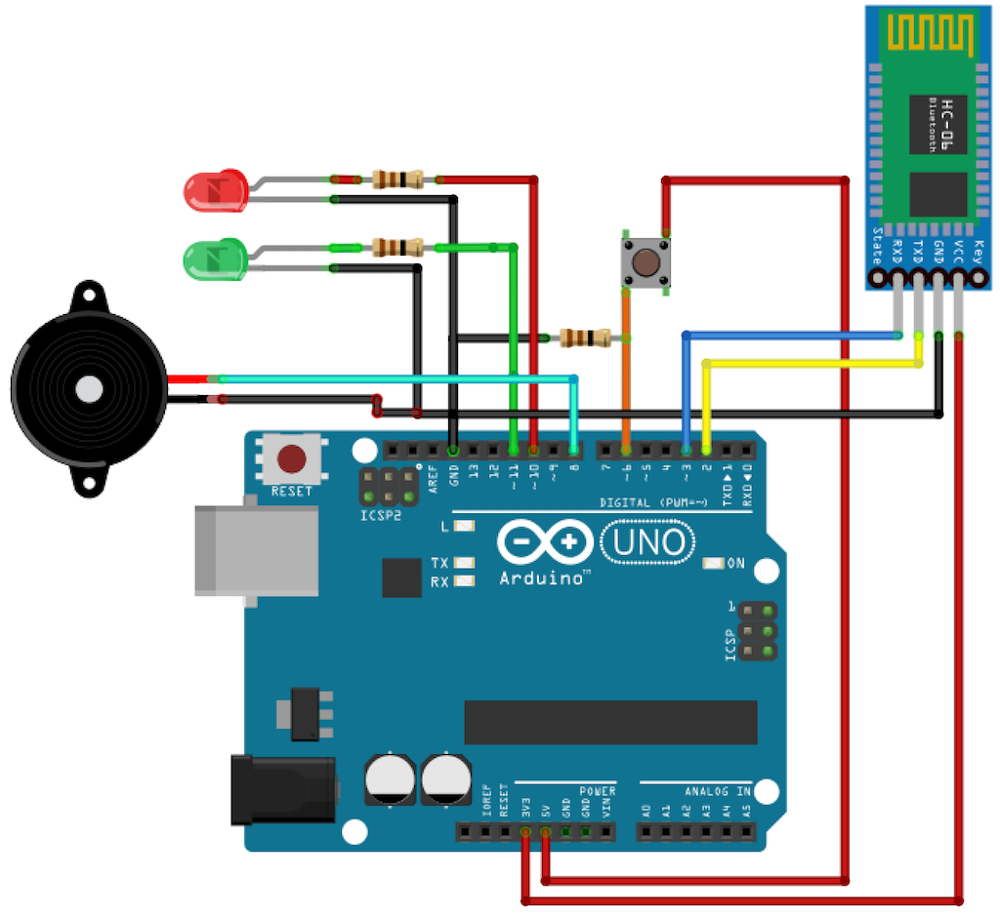
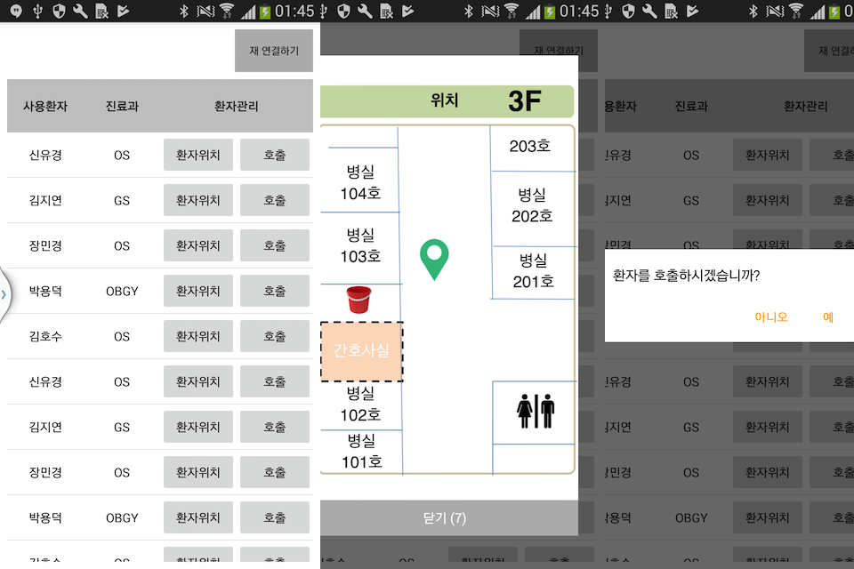

#  호출기 (KnockKncok)
> Arduino 와 Android 를 연동하여 원격 호출기를 만든다

## 개요

1. Arduino 와 Android 가 Bluetooth 로 연결되어 있다.
2. Arduino 측의 버튼을 누르면
3. Android 측에서 팝업이 노출된다.

## Arduino

### Devices

1. Arduino UNO
2. Blutooth Module ; HC-06
3. Push Button

### Circuits

## Android

### Scenario

1. MainActivity 에서 BTConnector 서비스를 실행
2. BTConnector 는 백그라운드에서 동작하며 BT 신호를 수신
3. BT 신호 수신 시 Broadcast 를 보냄
4. BroadcastReceiver 는 
    1. Foreground 시 : 팝업창을 화면에 띄운다.
    2. Background 시 : Notification 을 띄운다. (TODO)
5. Notification 선택 시 팝업창을 화면에 띄운다. (TODO)

### Screenshot

## License

KnockKncok is available under the MIT license. See the [LICENSE](LICENSE) file for more info.